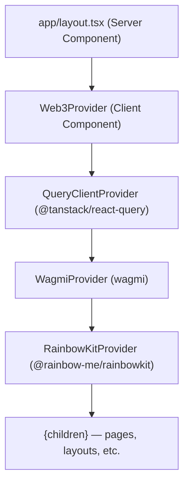

# Design Document: ArenSwap Setup

## Overview

This document describes the technical design for the ArenSwap project setup. The work spans two sibling directories:

- `arenswap-frontend/` — an existing Next.js 16 App Router project that receives the Web3 stack (Wagmi v2, Viem, RainbowKit) and a root provider component.
- `arenswap-contracts/` — a new Foundry project initialized alongside the frontend, containing the scaffolded USDC-to-EURC swap contract.

The goal of this phase is a working, buildable baseline: the frontend can connect wallets on the Arc Testnet, and the contracts project compiles and passes its stub tests.

---

## Architecture

### Repository Layout

```
d:\
├── arenswap-frontend/          # Next.js 16 App Router (existing)
│   ├── app/
│   │   ├── lib/
│   │   │   └── wagmi.ts        # NEW — Wagmi config + Arc Testnet chain
│   │   ├── providers/
│   │   │   └── Web3Provider.tsx # NEW — client-side provider tree
│   │   ├── layout.tsx          # MODIFIED — wraps children with Web3Provider
│   │   ├── page.tsx
│   │   └── globals.css
│   ├── package.json
│   └── ...
│
└── arenswap-contracts/         # NEW — Foundry project (sibling)
    ├── src/
    │   └── ArenSwap.sol        # NEW — swap contract scaffold
    ├── test/
    │   └── ArenSwap.t.sol      # NEW — test scaffold
    ├── script/
    │   └── ArenSwap.s.sol      # NEW — deployment script scaffold
    ├── lib/
    │   └── forge-std/          # installed by forge init
    └── foundry.toml
```

### Component Hierarchy (Frontend)



The root layout stays a Server Component. It imports `Web3Provider` (a Client Component), which establishes the `'use client'` boundary. All three context providers live inside that boundary, so they have access to browser APIs and React state.

---

## Components and Interfaces

### `app/lib/wagmi.ts` — Wagmi Configuration

Exports a single `wagmiConfig` object created with `createConfig`. Defines the Arc Testnet as a custom Viem chain and wires it to an HTTP transport.

```typescript
'use client'

import { createConfig, http } from 'wagmi'
import { defineChain } from 'viem'

export const arcTestnet = defineChain({
  id: 5042002,
  name: 'Arc Testnet',
  nativeCurrency: {
    name: 'USD Coin',
    symbol: 'USDC',
    decimals: 6,
  },
  rpcUrls: {
    default: { http: ['https://rpc.testnet.arcscan.app'] },
  },
  blockExplorers: {
    default: {
      name: 'ArcScan',
      url: 'https://testnet.arcscan.app',
    },
  },
})

export const wagmiConfig = createConfig({
  chains: [arcTestnet],
  transports: {
    [arcTestnet.id]: http('https://rpc.testnet.arcscan.app'),
  },
})
```

**SSR safety**: The `'use client'` directive at the top of this file ensures the module is only evaluated in the browser bundle. No `window`, `document`, or `localStorage` calls appear at module evaluation time. `createConfig` and `defineChain` are pure data constructors with no browser-global side effects.

**Design decision — `'use client'` on the config module**: Wagmi v2's `createConfig` is safe to call on the server, but RainbowKit's `getDefaultConfig` (not used here) and some connector factories are not. Marking the config module `'use client'` is the safest default and prevents accidental server-side evaluation of any future connector additions.

---

### `app/providers/Web3Provider.tsx` — Root Web3 Provider

A Client Component that composes the three required providers in the correct nesting order.

```typescript
'use client'

import { QueryClient, QueryClientProvider } from '@tanstack/react-query'
import { WagmiProvider } from 'wagmi'
import { RainbowKitProvider, coolTheme } from '@rainbow-me/rainbowkit'
import { wagmiConfig } from '@/app/lib/wagmi'
import '@rainbow-me/rainbowkit/styles.css'

const queryClient = new QueryClient()

export default function Web3Provider({
  children,
}: {
  children: React.ReactNode
}) {
  return (
    <QueryClientProvider client={queryClient}>
      <WagmiProvider config={wagmiConfig}>
        <RainbowKitProvider theme={coolTheme()}>
          {children}
        </RainbowKitProvider>
      </WagmiProvider>
    </QueryClientProvider>
  )
}
```

**Design decision — `QueryClient` instantiated at module scope**: The `QueryClient` instance is created once at module scope rather than inside the component body. This prevents a new client being created on every render, which would reset all cached query state. Because this file is `'use client'`, module scope is per-browser-tab, not per-request, so there is no cross-request state leakage.

**Design decision — provider nesting order**: `QueryClientProvider` must be outermost because Wagmi v2 internally uses `@tanstack/react-query` hooks and requires the query context to already be present. `WagmiProvider` must wrap `RainbowKitProvider` because RainbowKit reads from Wagmi's context to display wallet state.

**Design decision — RainbowKit styles import**: `@rainbow-me/rainbowkit/styles.css` must be imported in a Client Component (not a Server Component) to avoid a build error with Turbopack, which is now the default bundler in Next.js 16.

---

### `app/layout.tsx` — Root Layout (modified)

The root layout remains a Server Component. `Web3Provider` is imported and used to wrap `{children}` inside `<body>`. The `metadata` export, `geistSans`, and `geistMono` font variables are preserved unchanged.

```typescript
import type { Metadata } from 'next'
import { Geist, Geist_Mono } from 'next/font/google'
import './globals.css'
import Web3Provider from './providers/Web3Provider'

const geistSans = Geist({
  variable: '--font-geist-sans',
  subsets: ['latin'],
})

const geistMono = Geist_Mono({
  variable: '--font-geist-mono',
  subsets: ['latin'],
})

export const metadata: Metadata = {
  title: 'Create Next App',
  description: 'Generated by create next app',
}

export default function RootLayout({
  children,
}: Readonly<{
  children: React.ReactNode
}>) {
  return (
    <html
      lang="en"
      className={`${geistSans.variable} ${geistMono.variable} h-full antialiased`}
    >
      <body className="min-h-full flex flex-col">
        <Web3Provider>{children}</Web3Provider>
      </body>
    </html>
  )
}
```

**Design decision — layout stays a Server Component**: Keeping `layout.tsx` as a Server Component means Next.js can statically render the HTML shell, fonts, and metadata on the server. Only the `Web3Provider` subtree is hydrated on the client. This follows the Next.js 16 recommendation to push `'use client'` boundaries as deep as possible.

---

### `arenswap-contracts/src/ArenSwap.sol` — Swap Contract Scaffold

```solidity
// SPDX-License-Identifier: MIT
pragma solidity ^0.8.20;

interface IERC20 {
    function transfer(address to, uint256 amount) external returns (bool);
    function transferFrom(address from, address to, uint256 amount) external returns (bool);
    function approve(address spender, uint256 amount) external returns (bool);
    function balanceOf(address account) external view returns (uint256);
}

contract ArenSwap {
    address public immutable usdc;
    address public immutable eurc;
    uint256 public swapRate;
    address public owner;

    modifier onlyOwner() {
        require(msg.sender == owner, "ArenSwap: caller is not the owner");
        _;
    }

    constructor(address _usdc, address _eurc) {
        usdc = _usdc;
        eurc = _eurc;
        owner = msg.sender;
    }

    function setSwapRate(uint256 newRate) external onlyOwner {
        swapRate = newRate;
    }

    function swap(uint256 usdcAmount) external {
        require(usdcAmount > 0, "ArenSwap: amount must be greater than zero");
        // TODO: implement swap logic
        // Expected computation shape: eurcAmount = usdcAmount * swapRate
        // 1. transferFrom caller's USDC to this contract
        // 2. transfer eurcAmount of EURC from this contract to caller
    }
}
```

**Design decision — inline `IERC20` interface**: Rather than importing OpenZeppelin, the interface is defined inline. This keeps the scaffold self-contained and avoids a dependency that hasn't been discussed yet. The interface can be replaced with an OZ import when the swap logic is implemented.

**Design decision — `immutable` token addresses**: `usdc` and `eurc` are `immutable`, set once in the constructor and baked into the contract bytecode. This eliminates the gas cost of an SLOAD on every swap and prevents accidental or malicious address changes post-deployment.

**Design decision — `onlyOwner` without OpenZeppelin `Ownable`**: A minimal hand-rolled `onlyOwner` pattern is used for the scaffold. It is straightforward, auditable, and avoids pulling in a dependency before the project structure is finalized.

---

### `arenswap-contracts/test/ArenSwap.t.sol` — Test Scaffold

```solidity
// SPDX-License-Identifier: MIT
pragma solidity ^0.8.20;

import "forge-std/Test.sol";
import "../src/ArenSwap.sol";

contract ArenSwapTest is Test {
    ArenSwap public arenSwap;
    address public owner;
    address public usdc;
    address public eurc;

    function setUp() public {
        // TODO: deploy mock ERC20 tokens and ArenSwap
    }

    function test_placeholder() public {
        // TODO: add real tests
        assertTrue(true);
    }
}
```

---

### `arenswap-contracts/script/ArenSwap.s.sol` — Deployment Script Scaffold

```solidity
// SPDX-License-Identifier: MIT
pragma solidity ^0.8.20;

import "forge-std/Script.sol";
import "../src/ArenSwap.sol";

contract ArenSwapScript is Script {
    function run() external {
        address usdcAddress = address(0); // TODO: replace with actual USDC address
        address eurcAddress = address(0); // TODO: replace with actual EURC address
        uint256 initialSwapRate = 0;      // TODO: replace with actual initial swap rate

        vm.startBroadcast();
        new ArenSwap(usdcAddress, eurcAddress);
        vm.stopBroadcast();
    }
}
```

---

## Data Models

### Arc Testnet Chain Definition

| Field | Value |
|---|---|
| Chain ID | `5042002` |
| Name | `"Arc Testnet"` |
| Native currency name | `"USD Coin"` |
| Native currency symbol | `"USDC"` |
| Native currency decimals | `6` |
| RPC URL | `https://rpc.testnet.arcscan.app` |
| Block explorer URL | `https://testnet.arcscan.app` |

### ArenSwap Contract State

| Variable | Type | Mutability | Description |
|---|---|---|---|
| `usdc` | `address` | `immutable` | USDC token contract address |
| `eurc` | `address` | `immutable` | EURC token contract address |
| `swapRate` | `uint256` | mutable (owner only) | EURC wei returned per 1 USDC wei |
| `owner` | `address` | mutable (owner only via transfer) | Contract administrator |

---

## Correctness Properties

*A property is a characteristic or behavior that should hold true across all valid executions of a system — essentially, a formal statement about what the system should do. Properties serve as the bridge between human-readable specifications and machine-verifiable correctness guarantees.*

The prework analysis identified two acceptance criteria (6.7 and 6.8) that are suitable for property-based testing. Both relate to the `onlyOwner` access control pattern. After property reflection, they consolidate into a single property because 6.8 (setSwapRate is protected) is a specific instance of 6.7 (onlyOwner reverts for non-owners). A single comprehensive property covers both.

### Property 1: Non-owner calls to owner-protected functions always revert

*For any* address that is not the contract owner, calling `setSwapRate` SHALL revert with the message `"ArenSwap: caller is not the owner"`.

**Validates: Requirements 6.7, 6.8**

---

## Error Handling

### Frontend

| Scenario | Handling |
|---|---|
| Wallet not connected | RainbowKit's built-in connect modal handles this; no custom error handling needed at setup phase |
| Wrong network | RainbowKit displays a "switch network" prompt when the connected chain doesn't match `arcTestnet` |
| RPC unreachable | Wagmi surfaces transport errors through its query hooks; pages consuming wallet state should handle loading/error states |

### Smart Contract

| Scenario | Error |
|---|---|
| `swap(0)` called | `require` reverts: `"ArenSwap: amount must be greater than zero"` |
| Non-owner calls `setSwapRate` | `onlyOwner` modifier reverts: `"ArenSwap: caller is not the owner"` |
| Insufficient EURC balance in contract | Will revert at the ERC-20 `transfer` call (to be implemented) |
| Insufficient USDC allowance | Will revert at the ERC-20 `transferFrom` call (to be implemented) |

---

## Testing Strategy

### Frontend

**Unit / example tests** (using Vitest + React Testing Library):

- Import `wagmiConfig` in a Node.js test environment and assert the Arc Testnet chain fields match the specification (chain ID, name, currency, RPC URL, block explorer URL). This also validates SSR safety — if the import throws a `ReferenceError` for a browser global, the test fails.
- Render `Web3Provider` with a test child and assert the child is present in the output.
- Assert `RainbowKitProvider` receives a `theme` prop (verifying `coolTheme()` is passed).

Property-based testing is not appropriate for the frontend portion of this setup. The acceptance criteria are configuration checks, structural checks, and specific example behaviors — none have a meaningful input space that would benefit from 100+ randomized iterations.

### Smart Contracts

**Foundry tests** (in `ArenSwap.t.sol`):

- **Edge case**: Call `swap(0)` and expect a revert with `"ArenSwap: amount must be greater than zero"` (Requirement 6.6).
- **Property test** (using Foundry's fuzzer): For any `address caller` where `caller != owner`, calling `setSwapRate(anyRate)` as `caller` SHALL revert (Requirements 6.7, 6.8). Foundry's built-in fuzzer generates random addresses, providing 100+ iterations automatically.

```solidity
// Property 1: Non-owner calls to setSwapRate always revert
// Feature: arenswap-setup, Property 1: non-owner calls to owner-protected functions always revert
function testFuzz_setSwapRate_revertsForNonOwner(address caller, uint256 newRate) public {
    vm.assume(caller != owner);
    vm.prank(caller);
    vm.expectRevert("ArenSwap: caller is not the owner");
    arenSwap.setSwapRate(newRate);
}
```

**Integration checks** (run manually or in CI):
- `forge build` exits with code 0 (Requirement 5.4).
- `forge test` exits with code 0 (Requirement 7.4).

---

## Dependencies and Versions

### Frontend — packages to install

Run from `arenswap-frontend/`:

```bash
npm install wagmi@2.15.4 viem@2.31.3 @rainbow-me/rainbowkit@2.2.5 @tanstack/react-query@5.80.7
```

All four packages must be listed under `dependencies` (not `devDependencies`) and pinned to exact versions (no `^` or `~`).

| Package | Version | Role |
|---|---|---|
| `wagmi` | `2.15.4` | React hooks for Ethereum |
| `viem` | `2.31.3` | Low-level Ethereum client (peer dep of wagmi) |
| `@rainbow-me/rainbowkit` | `2.2.5` | Wallet connect UI |
| `@tanstack/react-query` | `5.80.7` | Async state management (required by wagmi v2) |

> **Note**: Verify the latest compatible versions at install time. The versions above are current as of this document. RainbowKit 2.x requires Wagmi 2.x and Viem 2.x. Check `@rainbow-me/rainbowkit`'s peer dependency requirements before pinning.

### Contracts — toolchain

| Tool | Version | Notes |
|---|---|---|
| Foundry (`forge`) | latest stable | Install via `curl -L https://foundry.paradigm.xyz \| bash && foundryup` |
| Solidity | `^0.8.20` | Specified in `pragma`; Foundry resolves the compiler automatically |

No additional Solidity dependencies are needed for the scaffold. OpenZeppelin contracts may be added in a later phase when swap logic is implemented.
