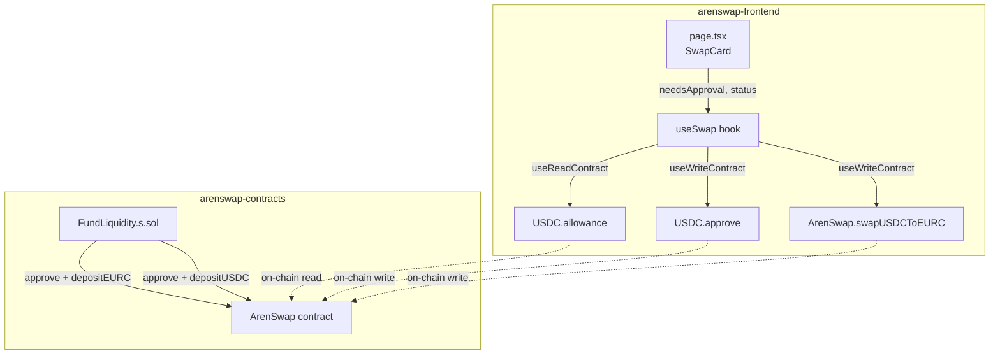

# Design Document — swap-fix

## Overview

Two defects prevent ArenSwap swaps from completing:

1. **Redundant approvals** — `executeSwap` always fires an ERC-20 `approve` transaction, even when the user already has sufficient allowance. This wastes gas and adds an unnecessary confirmation step.
2. **Zero EURC reserves** — the deployed ArenSwap contract holds no EURC, so every `swapUSDCToEURC` call reverts with "ArenSwap: insufficient EURC reserve".

The fix has two independent parts:

- **Frontend** (`arenswap-frontend`): read the current USDC allowance on mount and skip the `approve` transaction when the existing allowance already covers the swap amount.
- **Contracts** (`arenswap-contracts`): a Foundry broadcast script that approves and deposits EURC (and USDC) into the ArenSwap contract in a single command.

---

## Architecture



The allowance check is a pure on-chain read that runs continuously via wagmi's `useReadContract`. The result feeds a `needsApproval` boolean that gates both the `executeSwap` logic and the button label in the UI.

---

## Components and Interfaces

### `app/lib/contracts.ts` — Add `allowance` to `ERC20_ABI`

The existing `ERC20_ABI` is missing the `allowance` view function. Adding it allows `useReadContract` to call it with full type safety.

```typescript
{
  name: 'allowance',
  type: 'function',
  stateMutability: 'view',
  inputs: [
    { name: 'owner',   type: 'address' },
    { name: 'spender', type: 'address' },
  ],
  outputs: [{ name: '', type: 'uint256' }],
},
```

This fragment is appended to the existing `ERC20_ABI` array alongside `approve` and `balanceOf`.

---

### `app/hooks/useSwap.ts` — Allowance-aware state machine

#### Updated `SwapStatus` type

```typescript
export type SwapStatus =
  | 'idle'
  | 'needs-approval'   // ← new: allowance insufficient, waiting for user to approve
  | 'approving'
  | 'approved'
  | 'swapping'
  | 'success'
  | 'error'
```

`'needs-approval'` is a transient state set at the start of `executeSwap` when the allowance check determines approval is required. It transitions immediately to `'approving'` as the approve write is fired. Its primary value is making the state machine explicit and traceable.

#### Updated `UseSwapReturn` interface

```typescript
export interface UseSwapReturn {
  swapRate:      bigint | undefined
  isRateLoading: boolean
  isRateError:   boolean
  needsApproval: boolean          // ← new
  status:        SwapStatus
  error:         string | null
  successTxHash: `0x${string}` | undefined
  executeSwap:   (usdcAmount: string) => void
  resetError:    () => void
}
```

#### Allowance read

```typescript
const { address } = useAccount()

const {
  data: allowanceData,
  isLoading: isAllowanceLoading,
} = useReadContract({
  abi: ERC20_ABI,
  address: USDC_ADDRESS,
  functionName: 'allowance',
  args: address ? [address, ARENSWAP_ADDRESS] : undefined,
  query: { enabled: !!address },
})

const allowance = allowanceData as bigint | undefined
```

The read is only enabled when `address` is defined. While loading, `allowance` is `undefined`.

#### `needsApproval` computation

```typescript
const needsApproval: boolean = (() => {
  if (!payAmount || payAmount === '' || Number(payAmount) <= 0) return false
  let encoded: bigint
  try { encoded = encodeUsdcAmount(payAmount) } catch { return false }
  if (encoded === BigInt(0)) return false
  if (isAllowanceLoading || allowance === undefined) return true  // conservative
  return allowance < encoded
})()
```

`needsApproval` is `false` when the amount is zero or empty, and `true` when the allowance is still loading (conservative — prevents a flash of "Swap" before the read resolves).

> **Note**: `needsApproval` is a derived value computed from `allowance` and the current input amount. It is not stored in state — it is recalculated on every render.

#### Updated `executeSwap`

```typescript
function executeSwap(usdcAmount: string): void {
  const encoded = encodeUsdcAmount(usdcAmount)
  if (encoded === BigInt(0)) return

  // Guard: allowance still loading — do nothing
  if (isAllowanceLoading || allowance === undefined) return

  capturedAmount.current = encoded
  setError(null)

  if (allowance >= encoded) {
    // Sufficient allowance — skip approve, go straight to swap
    setStatus('swapping')
    swapWrite.writeContract({
      abi: ARENSWAP_ABI,
      address: ARENSWAP_ADDRESS,
      functionName: 'swapUSDCToEURC',
      args: [encoded],
    })
  } else {
    // Insufficient allowance — request approval first
    setStatus('needs-approval')
    setStatus('approving')
    approveWrite.writeContract({
      abi: ERC20_ABI,
      address: USDC_ADDRESS,
      functionName: 'approve',
      args: [ARENSWAP_ADDRESS, encoded],
    })
  }
}
```

All existing effects (approval receipt → `'approved'` → fire swap, swap receipt → `'success'`/`'error'`, write errors) are **unchanged**.

---

### `app/page.tsx` — Button label

The button label logic gains two new branches at the top of the idle/error path:

```typescript
// Inside the else branch (wallet connected, correct chain, not pending):
if (needsApproval && (status === 'idle' || status === 'error' || status === 'needs-approval')) {
  buttonLabel = 'Approve USDC'
} else if (!needsApproval && status === 'idle') {
  buttonLabel = 'Swap'
}
// All other guards (amount zero, amount too large) remain unchanged and run after these.
```

The `needsApproval` value is destructured from `useSwap()` alongside the existing fields.

Full button state priority (highest to lowest):

| Condition | Label | Disabled |
|---|---|---|
| Not connected | "Connect Wallet" | ✓ |
| Wrong chain | "Switch to Arc Testnet" | ✓ |
| `status === 'approving'` | "Approving USDC…" + spinner | ✓ |
| `status === 'swapping'` | "Swapping…" + spinner | ✓ |
| Amount too large | "Amount too large" | ✓ |
| `encodedAmount === 0n` | "Enter an amount" | ✓ |
| `needsApproval === true` | "Approve USDC" | ✗ |
| `needsApproval === false` | "Swap" | ✗ |

---

### `script/FundLiquidity.s.sol` — Foundry liquidity script

Located at `script/FundLiquidity.s.sol` in the `arenswap-contracts` project.

```solidity
// SPDX-License-Identifier: MIT
pragma solidity ^0.8.20;

import "forge-std/Script.sol";
import "../src/ArenSwap.sol";

interface IERC20Minimal {
    function approve(address spender, uint256 amount) external returns (bool);
}

contract FundLiquidityScript is Script {
    address constant ARENSWAP = 0x936B1516B784C3E2CC064e645BEBB614781D13Bd;
    address constant EURC     = 0x89B50855Aa3bE2F677cD6303Cec089B5F319D72a;
    address constant USDC     = 0x3600000000000000000000000000000000000000;

    uint256 constant DEPOSIT_EURC_AMOUNT = 1_000_000_000; // 1000 EURC (6 decimals)
    uint256 constant DEPOSIT_USDC_AMOUNT = 1_000_000_000; // 1000 USDC (6 decimals)

    function run() external {
        vm.startBroadcast();

        // Approve and deposit EURC
        IERC20Minimal(EURC).approve(ARENSWAP, DEPOSIT_EURC_AMOUNT);
        ArenSwap(ARENSWAP).depositEURC(DEPOSIT_EURC_AMOUNT);

        // Approve and deposit USDC
        IERC20Minimal(USDC).approve(ARENSWAP, DEPOSIT_USDC_AMOUNT);
        ArenSwap(ARENSWAP).depositUSDC(DEPOSIT_USDC_AMOUNT);

        vm.stopBroadcast();
    }
}
```

Run command:

```bash
forge script script/FundLiquidity.s.sol \
  --rpc-url https://rpc.testnet.arc.network \
  --broadcast \
  --private-key $PRIVATE_KEY
```

Design decisions:
- `IERC20Minimal` is declared inline rather than importing OpenZeppelin to keep the script self-contained and avoid dependency version conflicts.
- All deposit amounts are compile-time constants so changing them requires editing only the constant declarations, not the `run()` body.
- `vm.startBroadcast()` / `vm.stopBroadcast()` without an explicit private key argument — the key is supplied via `--private-key` at the CLI, keeping secrets out of source.

---

## Data Models

### `SwapStatus` (discriminated union)

```
idle → (executeSwap called)
  ├─ allowance >= encodedAmount → swapping → success | error
  └─ allowance < encodedAmount  → needs-approval → approving
                                                      └─ (approve receipt success) → approved → swapping → success | error
                                                      └─ (approve receipt error)   → error
```

### `UseSwapReturn` fields

| Field | Type | Description |
|---|---|---|
| `swapRate` | `bigint \| undefined` | Current swap rate from contract (MicroUnits per USDC) |
| `isRateLoading` | `boolean` | True while swap rate read is pending |
| `isRateError` | `boolean` | True if swap rate read failed or returned 0 |
| `needsApproval` | `boolean` | True when current allowance < encodedAmount |
| `status` | `SwapStatus` | Current state machine status |
| `error` | `string \| null` | Error message when status is `'error'` |
| `successTxHash` | `` `0x${string}` \| undefined `` | Swap tx hash when status is `'success'` |
| `executeSwap` | `(usdcAmount: string) => void` | Initiates the swap flow |
| `resetError` | `() => void` | Resets status to `'idle'` and clears error |

### `encodeUsdcAmount` contract

```
encodeUsdcAmount(s: string): bigint
  - Returns 0n if s is empty, non-finite, or <= 0
  - Returns BigInt(Math.floor(parseFloat(s) * 1_000_000)) for valid inputs
  - Throws RangeError if result exceeds Number.MAX_SAFE_INTEGER
```

---

## Correctness Properties

*A property is a characteristic or behavior that should hold true across all valid executions of a system — essentially, a formal statement about what the system should do. Properties serve as the bridge between human-readable specifications and machine-verifiable correctness guarantees.*

### Property 1: Sufficient allowance skips approve

*For any* valid USDC amount string and any allowance value where `allowance >= encodeUsdcAmount(amount)`, calling `executeSwap(amount)` SHALL NOT invoke the `approve` write contract and SHALL transition status to `'swapping'`.

**Validates: Requirements 2.2**

---

### Property 2: Insufficient allowance triggers approve

*For any* valid USDC amount string and any allowance value where `allowance < encodeUsdcAmount(amount)`, calling `executeSwap(amount)` SHALL invoke the `approve` write contract with `args = [ARENSWAP_ADDRESS, encodeUsdcAmount(amount)]`.

**Validates: Requirements 2.3**

---

### Property 3: `encodeUsdcAmount` round-trip correctness

*For any* valid positive numeric string `s` (representable as a finite float), `encodeUsdcAmount(s)` SHALL equal `BigInt(Math.floor(parseFloat(s) * 1_000_000))`.

**Validates: Requirements 4.3**

---

## Error Handling

| Scenario | Behaviour |
|---|---|
| Allowance read pending | `executeSwap` returns early (no-op); `needsApproval` is `true` (conservative) |
| Allowance read error | `allowance` treated as `undefined`; `executeSwap` returns early |
| `approve` tx reverted | Status → `'error'`, error = `'Approval transaction was reverted'` |
| `swapUSDCToEURC` tx reverted | Status → `'error'`, error = `'Swap transaction was reverted'` |
| `approve` write rejected (user rejection) | `approveWrite.error` fires; status → `'error'`, error = rejection message |
| `swapUSDCToEURC` write rejected | `swapWrite.error` fires; status → `'error'`, error = rejection message |
| Amount is zero or empty | `executeSwap` returns early; `needsApproval` is `false` |
| Amount too large (> MAX_SAFE_INTEGER) | `encodeUsdcAmount` throws `RangeError`; UI shows "Amount too large" |
| `resetError` called | Status → `'idle'`, error → `null` |

---

## Testing Strategy

### Unit tests (example-based)

Focus on specific states and concrete examples that property tests do not cover:

- `ERC20_ABI` contains an `allowance` fragment with correct shape (Req 1.1)
- Hook calls `useReadContract` with correct args when address is defined (Req 1.2)
- Hook returns early from `executeSwap` when allowance is loading (Req 1.3, 2.5)
- `needsApproval` is `false` when amount is empty or zero (Req 4.2)
- `needsApproval` is `true` when allowance is `undefined` and amount is non-zero (Req 1.3)
- Button shows "Approve USDC" when `needsApproval=true`, `status='idle'` (Req 3.2)
- Button shows "Swap" when `needsApproval=false`, `status='idle'` (Req 3.3)
- Button shows "Approving USDC…" and is disabled when `status='approving'` (Req 3.4)
- Button shows "Swapping…" and is disabled when `status='swapping'` (Req 3.5)
- Approve receipt success → status transitions to `'approved'` then `'swapping'` (Req 2.4)
- Swap receipt success → status `'success'`, `successTxHash` set (Req 6.1)
- Approve receipt error → status `'error'`, correct message (Req 6.2)
- Swap receipt error → status `'error'`, correct message (Req 6.3)
- `resetError` → status `'idle'`, error `null` (Req 6.4)
- Hook still exposes `swapRate`, `isRateLoading`, `isRateError` (Req 6.5)

### Property-based tests

Use a property-based testing library (e.g., [fast-check](https://github.com/dubzzz/fast-check) for TypeScript). Each test runs a minimum of **100 iterations**.

**Property 1 — Sufficient allowance skips approve**
- Generator: random valid USDC amount strings (positive floats, 1–6 decimal places); random `bigint` allowance values ≥ `encodeUsdcAmount(amount)`
- Assert: `approveWrite.writeContract` is never called; status becomes `'swapping'`
- Tag: `Feature: swap-fix, Property 1: sufficient allowance skips approve`

**Property 2 — Insufficient allowance triggers approve**
- Generator: random valid USDC amount strings; random `bigint` allowance values < `encodeUsdcAmount(amount)` (including `0n`)
- Assert: `approveWrite.writeContract` is called with `[ARENSWAP_ADDRESS, encodeUsdcAmount(amount)]`
- Tag: `Feature: swap-fix, Property 2: insufficient allowance triggers approve`

**Property 3 — `encodeUsdcAmount` round-trip correctness**
- Generator: random positive numeric strings representable as finite floats (e.g., `fc.float({ min: 0.000001, max: 999999 }).map(String)`)
- Assert: `encodeUsdcAmount(s) === BigInt(Math.floor(parseFloat(s) * 1_000_000))`
- Tag: `Feature: swap-fix, Property 3: encodeUsdcAmount round-trip correctness`

### Forge build smoke test

```bash
forge build   # in arenswap-contracts — must exit 0
```

Validates: Requirements 5.1, 5.2, 5.7

### Frontend build checkpoint

```bash
npm run build   # in arenswap-frontend — must exit 0
```

Validates: TypeScript compilation, no type errors introduced by the new `needsApproval` field or updated `SwapStatus`.
